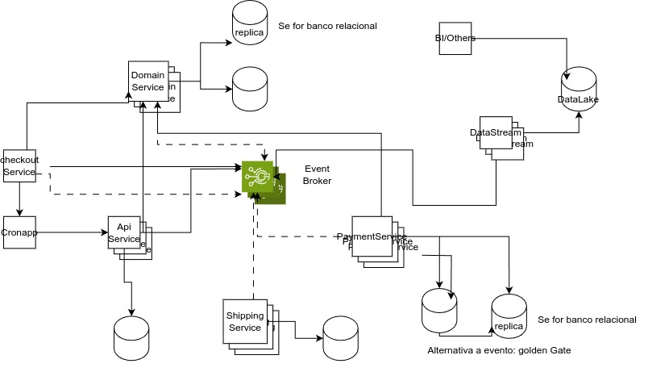
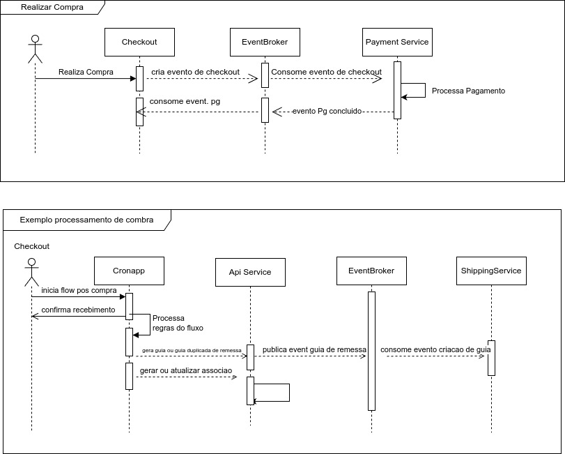

# Getting Started

### Reference Documentation
For further reference, please consider the following sections:

* [Official Gradle documentation](https://docs.gradle.org)
* [Spring Boot Gradle Plugin Reference Guide](https://docs.spring.io/spring-boot/docs/3.2.1/gradle-plugin/reference/html/)
* [Create an OCI image](https://docs.spring.io/spring-boot/docs/3.2.1/gradle-plugin/reference/html/#build-image)
* [Docker Compose Support](https://docs.spring.io/spring-boot/docs/3.2.1/reference/htmlsingle/index.html#features.docker-compose)
* [Spring Web](https://docs.spring.io/spring-boot/docs/3.2.1/reference/htmlsingle/index.html#web)
* [Spring Boot Actuator](https://docs.spring.io/spring-boot/docs/3.2.1/reference/htmlsingle/index.html#actuator)
* [Spring Data MongoDB](https://docs.spring.io/spring-boot/docs/3.2.1/reference/htmlsingle/index.html#data.nosql.mongodb)

### Docker Compose support
This project contains a Docker Compose file named `compose.yaml`.
In this file, the following services have been defined:

* mongodb: [`mongo:latest`](https://hub.docker.com/_/mongo)

Please review the tags of the used images and set them to the same as you're running in production.

### Application Overview
This is just an overview of how I would think about building a scalable, redundant, high-available application.
For sure there are several questions to be asked before starting the work, but I understood the purpose of this
is just to have a general idea about my approaches. I'm using event drive architecture, outbox, and N'layer based on
the problem description, but as I said this is an alternative in which we can discuss further the MongoDB or other
questions you might have.

The Spring Event was used in this case just to simplify the POC example, where the main objective here
is to replace a broker system which was drawn in the architecture image section.

### Architecture design


### Sequence diagrams


### How to start
To start it you can run the command below:

```./gradlew bootRun --args='-Pdocker-compose -Dspring-boot.run.profiles=docker-compose'```

also, there is in the source doe a run.xml for intellij users which can help you to run it.
- Remember this is a containerized application, so in order to run you need docker  and docker compose
  being stalled.
- The Java version used for this purpose was 17
 